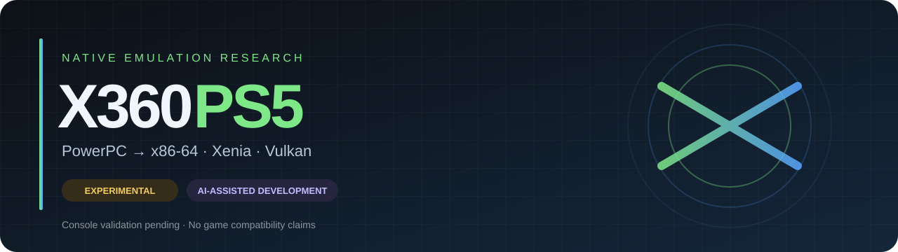
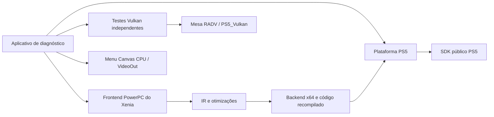

<div align="center">



**Pesquisa de emulação Xbox 360 nativa no PlayStation 5**


[📦 Downloads](https://github.com/polarco/X360PS5/releases) · [🧪 Testar](docs/TESTADOR.md) · [📊 Evidências](docs/VALIDACAO.md) · [🧠 Uso de IA](docs/DESENVOLVIMENTO_IA.md) · [📝 Changelog](CHANGELOG.md)

</div>

> [!WARNING]
> **Este projeto ainda não carrega jogos de Xbox 360 e não foi executado em um PS5.**
> O aplicativo nativo foi compilado e inspecionado. Os testes executados até agora são de computador/WSL. Não existe confirmação de compatibilidade, desempenho ou estabilidade no console.

> [!IMPORTANT]
> **IA é usada ativamente no desenvolvimento.** O Codex participou da pesquisa técnica, implementação, adaptação de código, automação de build e documentação. Isso não equivale a revisão humana independente nem comprova que o código funciona no PS5. Decisões de escopo e autorização são humanas; resultados precisam de evidências. [Leia a declaração completa →](docs/DESENVOLVIMENTO_IA.md)

## O que é o X360PS5?

O X360PS5 é um projeto experimental para investigar a adaptação do **Xenia Canary** ao PS5. A proposta é executar o núcleo diretamente como aplicativo nativo, preservando a tradução **PowerPC → x86-64** do Xenia e avançando, por etapas, para sua integração gráfica.

O primeiro marco é um diagnóstico verificável: memória, threads, exceções, execução de código recompilado, compute Vulkan e logs. A interface elaborada e as otimizações virão depois da emulação correta e mensurável.

**Alvo informado pelo testador:** firmware **13.60**, **Relapse**, **etaHEN**, **ShadowMountPlus** e **kstuff lite**. O modelo do console e as versões exatas dos componentes ainda estão pendentes. Essa lista descreve o ambiente pretendido; não é uma matriz de compatibilidade validada.

## Estado real do projeto

| Área | Implementação / evidência | PS5 |
| :--- | :--- | :---: |
| Aplicativo nativo | Executável vinculado e integridade inspecionada | ⏳ Não testado |
| Memória | Adaptador com aliases, proteção por página e testes em modelo host | ⏳ Não testado |
| CPU do Xenia | Três programas PowerPC executados no backend x64, em três ciclos no computador | ⏳ Não testado |
| JIT preliminar | Código x86 simples com retorno conhecido | ⏳ Não testado |
| Threads e exceções | Diagnóstico pthreads/mutex e recuperação de uma instrução UD2 controlada | ⏳ Não testado |
| Vulkan | Compute de 256 valores e clear/cópia/readback de imagem 8×8; validado no WSL com llvmpipe | ⏳ Não testado |
| Menu e DualSense | Menu implementado usando Canvas CPU + VideoOut | ⏳ Não testado |
| Logs | Escrita, flush e reabertura verificados no host | ⏳ Não testado |
| Estabilidade | Modo de dez minutos com carga de memória/threads e métricas parciais | ⏳ Não testado |
| Apresentação Vulkan / Xenos | Ainda não implementada/integrada | — |
| Homebrew Xbox 360 e jogos | Ainda não carregados | — |

**Resultados PowerPC esperados e observados no computador:** `42`, `4` e `0`.

Esses testes usam o frontend PowerPC e o backend x64 reais do Xenia. São programas aritméticos pequenos, sem kernel Xbox, jogos ou GPU emulada. Dois builds consecutivos produziram os mesmos hashes no mesmo ambiente; isso não comprova reprodução em outra máquina.

[Ver relatório de validação](docs/VALIDACAO.md) · [Ver resultados estruturados](docs/evidence/results.json) · [Ver logs](docs/evidence)

## Como as peças se conectam



O núcleo de CPU e o RADV estão vinculados ao aplicativo. **O renderizador Xenos do Xenia ainda não está integrado.** A imagem do menu vem de VideoOut; não demonstra apresentação Vulkan.

As adaptações estão em `port/`, `patches/` e `tools/xenia-overlay.py`. As revisões upstream permanecem identificáveis em [dependencies.lock.json](dependencies.lock.json).

[Entender a arquitetura e suas limitações →](docs/ARQUITETURA.md)

## Downloads e teste no console

A [pré-release](https://github.com/polarco/X360PS5/releases) reúne:

| Arquivo | Conteúdo |
| :--- | :--- |
| `X360PS5-0.1.1-diagnostic.zip` | Pasta de aplicativo `PPSA99361`, instruções, licenças e evidências |
| `X360PS5-0.1.1-sources.tar.gz` | Fontes próprias, fontes upstream fixadas e scripts |
| `SHA256SUMS` | Hashes dos arquivos e executáveis |

1. Leia o [roteiro do testador](docs/TESTADOR.md) e confirme modelo, versões e cadeia de carregamento.
2. Confira o SHA-256 e verifique se `PPSA99361` já é usado por outro aplicativo.
3. Instale manualmente conforme seu loader. O projeto não modifica firmware nem instala payloads.
4. Execute os testes individuais antes da sequência completa. Pare se houver falha.
5. Recolha os logs de `/data/x360ps5/logs`, uma foto do resultado e os dados do ambiente.

Os resultados usam **APROVADO**, **FALHOU** e **NÃO TESTADO**. Um `BEGIN` sem `END` significa interrupção, nunca aprovação. Um timeout de GPU bloqueia novos testes de GPU até reiniciar o aplicativo.

## Compilar no computador

Ambiente usado: **Ubuntu 26.04 no WSL**. Reserve espaço para fontes, toolchain, Mesa e artefatos. Dependências são fixadas por revisão; os pacotes do sistema ainda não estão congelados numa imagem reproduzível.

<details>
<summary><strong>1. Instalar as ferramentas</strong></summary>

```sh
sudo apt-get update
sudo apt-get install -y git make cmake ninja-build clang clang-18 clang-19 lld lld-18 \
  clang-21 llvm python3 python3-mako python3-yaml python3-packaging curl wget unzip rsync \
  meson pkg-config ccache zlib1g-dev libvulkan-dev glslang-tools spirv-tools-dev \
  libdrm-dev libexpat1-dev libzstd-dev libelf-dev bison flex libclang-21-dev \
  libllvmspirvlib-21-dev libclc-21-dev libc++-19-dev libc++abi-19-dev libclang-rt-dev
```

</details>

<details>
<summary><strong>2. Obter as fontes, compilar e testar</strong></summary>

```sh
git clone https://github.com/polarco/X360PS5.git
cd X360PS5
make deps
make test
make xenia-host
make ps5
```

O acesso ao repositório requer permissão enquanto ele for privado. `make deps` compila dependências e pode demorar.

</details>

<details>
<summary><strong>3. Registrar evidências e montar os pacotes</strong></summary>

```sh
python3 tools/validate.py
make package
```

`validate.py` executa os testes locais, inspeciona os executáveis e compara dois builds nativos consecutivos. Os pacotes ficam em `dist/`. Nenhum desses comandos se conecta ao PS5, instala aplicativos no console ou publica arquivos.

</details>

| Comando | Finalidade |
| :--- | :--- |
| `make test` | Diagnóstico host e modelo do adaptador de memória |
| `make xenia-host` | Teste separado do recompilador real do Xenia |
| `make ps5` | Aplicativo nativo em `dist/PPSA99361` |
| `python3 tools/validate.py` | Evidências locais e repetição do build |
| `make package` | Aplicativo, fontes e hashes |

## Roteiro de evolução

- [x] Fixar revisões upstream e separar builds host/PS5.
- [x] Implementar diagnóstico e adaptações iniciais de plataforma.
- [x] Executar pequenos programas PowerPC pelo Xenia no computador.
- [x] Vincular núcleo e RADV ao aplicativo nativo.
- [ ] Confirmar abertura, controles, logs e encerramento no console.
- [ ] Validar memória, exceções, PowerPC e compute no PS5.
- [ ] Implementar apresentação Vulkan e validar pipeline gráfico.
- [ ] Completar três sequências e dez minutos de carga no console.
- [ ] Carregar um executável homebrew de Xbox 360.
- [ ] Integrar renderização Xenos, áudio, controles e saves.
- [ ] Medir compatibilidade e desempenho com jogos escolhidos.

Não há previsão de desempenho, lista de jogos compatíveis ou data prometida para esses marcos.

## Limitações conhecidas

- Callbacks assíncronos de threads e recuperação de mutex com dono morto ainda geram falha explícita.
- O backing físico da memória compartilhada é antecipado; decommit zera/protege, mas não devolve a memória física.
- O teste de dez minutos exercita memória e threads; não equivale a dez minutos de emulação ou carga de GPU.
- Métricas de heap, memória compartilhada e `ru_maxrss` são parciais.
- Compilar e inspecionar um executável não confirma que ele inicializa no console.

## Contribuições e transparência

Relatos úteis incluem versão, modelo, firmware, versões dos payloads, último teste iniciado e logs. Evite enviar chaves, BIOS, dumps privados ou arquivos de jogos. Ao propor código, descreva o problema, a mudança e como ela foi verificada; se IA participou, declare esse uso.

O projeto mantém decisões em [ContextoGeral.md](ContextoGeral.md), notas de trabalho em [GPTContext.md](GPTContext.md) e histórico em [CHANGELOG.md](CHANGELOG.md). Esses registros contextualizam o trabalho; os logs são a evidência dos testes efetivamente executados.

## Créditos e referências

| Projeto | Papel neste trabalho |
| :--- | :--- |
| [Xenia Canary](https://github.com/xenia-canary/xenia-canary) | Núcleo de emulação e recompilador PowerPC → x64 |
| [PS5_Vulkan](https://github.com/mihawk-99/PS5_Vulkan) | Integração Mesa/RADV e ferramentas nativas |
| [PS5_Mesa](https://github.com/mihawk-99/PS5_Mesa) | Fontes Mesa para o alvo PS5 |
| [PS5 Payload SDK](https://github.com/mihawk-99/PS5_PayloadSDK) | Camada pública de plataforma |
| [PS5 Native App Boilerplate](https://github.com/blackbearreloaded/ps5-native-app-boilerplate) | Base do Canvas/VideoOut |
| [ProsperoEden](https://github.com/blackbearreloaded/ProsperoEden) | Referência de integração nativa |
| [XPSemu](https://github.com/ZiZc3/XPSemu/releases) | Referência de diagnóstico; emula Xbox original, não Xbox 360 |
| [PS5CEMU](https://github.com/premohq/PS5CEMU) | Referência de integração e permissões |
| [PS5SX2](https://github.com/Swordpdf/PS5SX2) | Referência de homebrew no PS5 |

O funcionamento de outros projetos não comprova o funcionamento deste port. Créditos e licenças upstream são preservados em [THIRD_PARTY_NOTICES.md](THIRD_PARTY_NOTICES.md).

---

<div align="center">

**Código próprio: GPL-3.0-or-later · Componentes upstream: respectivas licenças**

Projeto independente de pesquisa, sem afiliação com Microsoft, Sony ou as equipes dos projetos citados.

</div>
